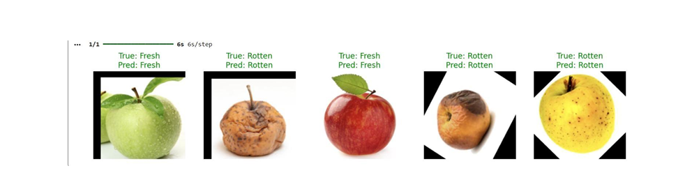

# Apple Quality Classification & Defect Detection System 🍎

## Project Overview
This project implements a Computer Vision system to automate the quality inspection of apples. It analyzes fruit images to detect surface defects and classify them into quality grades (Good/Defective).

### 📂 Key Files
* **`apple-quality-classification.ipynb`**: The main Python script containing image processing algorithms.
* **`Apple-quality-classification1.pdf`**: Detailed documentation of the methodology and testing results.

## Model Results 📊
The model achieved high accuracy in distinguishing between fresh and rotten apples. Below is a sample of the prediction results:

*Green text indicates correct classification (True Label matches Predicted Label).*

## Tools Used
- Python
- OpenCV / PIL
- NumPy
